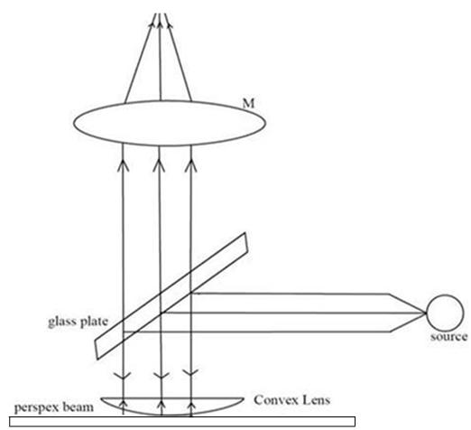
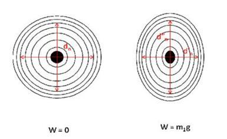

## Theory

  

 

An air film is obtained between convex lens and Perspex beam. The light is made to fall normally on the air film with the help of a glass plate on the arrangement.

The interference fringes formed is viewed by means of travelling microscope. Without adding any mass in the weight hanger we get circular rings. But as we uniformly add mass on the weight hangers the beam bends and we get elliptical fringes.

During bending, an extension is caused on the upper surface and compression on the lower surface.

Let R1 be the longitudinal radius of curvature of the beam. The internal bending moment caused by extension of the surface above the bar and compression below the bar is given by

$$\frac{YAK^2}{R_1}$$

where ,

Y is the young's modulus

A=ab, is the cross sectional area of bar

$K=\frac{b}{\sqrt{12}}$ ,the radius of gyration for rectangular cross section.

In equilibrium condition the internal bending moment must be balanced by the moment due to weight m1g attached to its ends

$$m_1g=\frac{YAK^2}{R_1}............(1)$$

On rearranging we get, young's modulus,

$$Y=\frac{12m_1glR_1}{ab^3}...............(2)$$

Also when the bar undergoes longitudinal bending, it also undergoes a lateral bending, resulting in lateral strain R2.

The ratio between these two quantities is the Poisson's ratio and is given by

$$\sigma =\frac{R_1}{R_2}...............(3)$$

  

 

The longitudinal bending R1 can be found out using the equation,

$$R_1 = \frac{1}{4n\lambda} \cdot \frac{d_n'^2 d_n^2}{(d_n^2 - d_n'^2)}..........(4)$$

  Where <i>dn'</i> and <i>dn</i> are the diameters of the nth ring with and without mass in the transverse direction.

  From the values of the diameters of the rings (with and without mass), we calculate <b>R1</b> and <b>R2</b>.

  Using the values of <b>R1</b> and <b>R2</b>, we can determine Young’s modulus.

$$Y = \frac{12 m_1 g l R_1}{a b^3}$$

Poisson's ratio, $\sigma=\frac{R_2}{R_1}$ and bulk modulus, $b=\frac{Y}{3(1-2\sigma)}$

