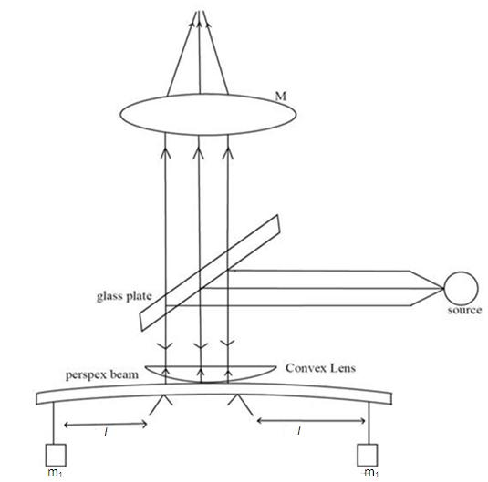

### Apparatus

- Sodium vapor lamp  
- Transparent beam  
- Convex lens  
- Travelling microscope  
- Two knife edges  
- A set of weights  
- Weight holders  
- Mirror  

### Experimental Set Up

  

 

Consider a rectangular Perspex beam of length `L`, breadth `a`, and thickness `b`. A plano-convex lens is placed over the beam. Weight hangers are placed at both ends, where mass can be added. Knife edges are positioned at a distance `l` from both weight hangers. A light source is used to illuminate the arrangement.

## Procedure

## 1. Real Lab

### To Find the Diameter of Rings Without Mass

1. Place the given Perspex beam symmetrically over the two knife edges.  
2. A convex lens is placed over the beam.  
3. As shown in the figure, light is allowed to fall normally on the air film with the help of a glass plate.  
4. On focusing, interference fringes formed are viewed by means of a travelling microscope.  
5. Fix the cross wire on any of the *nth* ring on one side (left or right) using the knob.  
6. Note the corresponding value of MSR (Main Scale Reading) and VSR (Vernier Scale Reading).  
7. Move the cross wire to the *(n−1)th* or *(n−2)nd* ring on the same side.  
8. Take the readings of the rings on either side of the center position.  
9. Now repeat the same procedure by moving the cross wire up and down on either side of the center position.

### Diameter of Rings With Mass

1. Adjust the distance between the weight hanger and the knife edges.  
2. Add mass on the weight hanger.  
3. Repeat steps 4–9 to measure the horizontal and vertical position of rings.

  

 

## 2. Simulator

### To Find the Diameter of Rings Without Mass

1. Set the mass on the weight hanger to **0 g**.  
2. Select desired values for the variables by clicking on the sliders for each variable.  
3. Click on the **‘Light On’** button.  
4. Now repeat steps 5–9 of the **Real Lab** procedure.  
5. The reading of rings during the horizontal/vertical motion is shown by the horizontal/vertical position value of the microscope under the **Variables** section.  
6. Click the **‘Reset’** button to enter another set of variable values.

### To Find the Diameter of Rings With Mass

1. Adjust the variables and the position of the weight hanger by clicking on their corresponding sliders.  
2. Add a suitable mass on the weight hanger.  
3. Repeat steps 3–6 of the **Simulator** section.

## Observations

### To Find the Thickness of the Perspex Beam Using Screw Gauge

Zero correction=

Thickness of Perspex beam, b=...........mm

### To find the breadth of Perspex beam using Vernier calipers

Breadth of plate, a=..........cm

### To find the diameter of rings in horizontal direction

λ=..........nm,  
l=.............cm

Longitudinal bending R1 

$$R_1 = \frac{1}{4n\lambda} \cdot \frac{d_n'^2 d_n^2}{(d_n^2 - d_n'^2)}$$

### To find the diameter of rings in vertical direction

 Lateral strain, R2

 $$R_2 = \frac{1}{4n\lambda} \cdot \frac{d_n'^2 d_n^2}{(d_n^2 - d_n'^2)}$$

## Results

#### For a given plate

- **Young’s modulus,** Y = ................... Nm⁻²  
- **Poisson’s ratio,** σ = .................. 
- **Bulk modulus,** B = ...................... Nm⁻²

